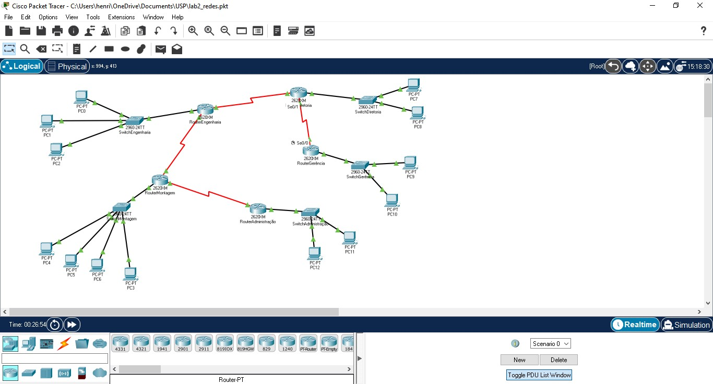
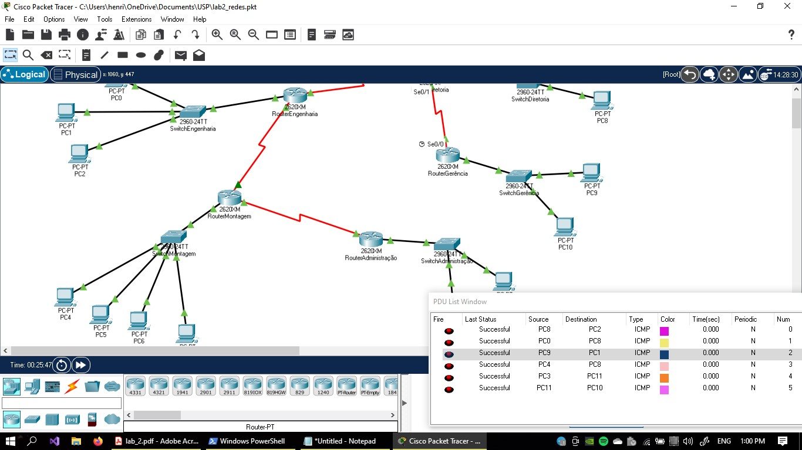

# Laboratório 2 - Redes de computadores

## Parte 1

Observação: As respostas consideram que o gateway é uma das máquinas listadas em
cada departamento, nas questões 1, 2 e 3.

### Questão 1

Rede: 10.33.44.0/24

a) Utilizando o método de otimização de redes, fazemos em ordem decrescente de
quantidade de máquinas.

- Engenharia: 58 endereços (sem contar com rede e broadcast), faixa de
  endereçamento /26. IP da subrede: 10.33.44.0.

- Montagem: 32 endereços (sem contar com rede e broadcast), faixa de
  endereçamento /26. IP da subrede: 10.33.44.64.

- Administração: 30 endereços (sem contar com rede e broadcast), faixa de
  endereçamento /27. IP da subrede: 10.33.44.96.

- Gerência: 9 endereços (sem contar com rede e broadcast), faixa de
  endereçamento /28. IP da subrede: 10.33.44.112.

- Diretoria: 4 endereços (sem contar com rede e broadcast), faixa de
  endereçamento /29. IP da subrede: 10.33.44.128.

b) Atribuindo os próximos endereços disponíveis às próximas redes, temos:

Depto           IP Rede        _Broadcast_  _Gateway_
--------------- ------------- ------------- ------------
Engenharia       10.33.44.0    10.33.44.63   10.33.44.1
Montagem         10.33.44.64   10.33.44.127  10.33.44.65
Administração    10.33.44.128  10.33.44.159  10.33.44.129
Gerência         10.33.44.160  10.33.44.175  10.33.44.161
Diretoria        10.33.44.176  10.33.44.183  10.33.44.177

c) Faixa de endereçamento válida:

- Engenharia: 		10.33.44.1   a 10.33.44.62
- Montagem: 		10.33.44.65  a 10.33.44.126
- Administração:	10.33.44.129 a 10.33.44.158
- Gerência: 		10.33.44.161 a 10.33.44.174
- Diretoria: 		10.33.44.177 a 10.33.44.182

### Questão 2

Rede: 192.100.50.0/24

a) Utilizando o método de otimização de redes, fazemos em ordem decrescente de
quantidade de máquinas.

- Engenharia é o setor com mais máquinas, tendo 64. São necessários 66 endereços
  IP para a rede, portanto uma subrede /25 deve ser atribuída. O endereço do
  intervalo de rede atribuído é 192.100.50.0/25.

- Montagem possui 16 máquinas, e precisa de 18 endereços, ou seja, uma rede /27.
  O endereço IP da subrede é 192.100.50.128/27.

- Administração possui 8 máquinas, e é necessário uma rede /28. O endereço IP do
  intervalo de rede que deve ser atribuído é 192.100.50.160/28.

- Gerência possui 4 computadores, e é necessário uma rede /29. O endereço IP o
  intervalo de rede que deve ser atribuído é 192.168.50.176/29.

- A Diretoria possui 2 computadores, e é precisa de uma rede /30. O endereço IP o
  intervalo de rede que deve ser atribuído é 192.168.50.184/30.

b)

 Depto             IP Rede         _Broadcast_       _Gateway_
---------------- ---------------- --------------- ---------------
Engenharia        192.100.50.0    192.100.50.127   192.100.50.1
Montagem          192.100.50.128  192.100.50.159   192.100.50.129
Administração     192.100.50.160  192.100.50.175   192.100.50.161
Gerência          192.100.50.176  192.100.50.183   192.100.50.177
Diretoria         192.100.50.184  192.100.50.187   192.100.50.185

c) Faixa de endereçamento válida:

- Engenharia: 		192.100.50.1   a 192.100.50.126
- Montagem: 		192.100.50.129 a 192.100.50.158
- Administração:	192.100.50.161 a 192.100.50.175
- Gerência: 		192.100.50.177 a 192.100.50.182
- Diretoria: 		192.100.50.185 a 192.100.50.186

### Questão 3

Rede: 125.23.34.0/24

a)

- Engenharia: 41 endereços (sem contar com rede e broadcast), faixa de
  endereçamento /26. IP da subrede: 125.23.34.0.

- Montagem: 27 endereços (sem contar com rede e broadcast), faixa de
  endereçamento /27. IP da subrede: 125.23.34.64.

- Administração: 12 endereços (sem contar com rede e broadcast), faixa de
  endereçamento /28. IP da subrede: 125.23.34.96.

- Gerência: 7 endereços (sem contar com rede e broadcast), faixa de
  endereçamento /28. IP da subrede: 125.23.34.112.

- Diretoria: 8 endereços (sem contar com rede e broadcast), faixa de
  endereçamento /28. IP da subrede: 125.23.34.128.

b)

 Depto             IP Rede         _Broadcast_       _Gateway_
---------------- ---------------- --------------- ---------------
 Engenharia       125.23.34.0     125.23.34.63    125.23.34.1
 Montagem         125.23.34.64    125.23.34.95    125.23.34.65
 Administração    125.23.34.96    125.23.34.111   125.23.34.97
 Gerência         125.23.34.112   125.23.34.127   125.23.34.113
 Diretoria        125.23.34.128   125.23.34.143   125.23.34.129

c) Faixa de endereçamento válida:

- Engenharia: 		125.23.34.1   a 125.23.34.62
- Montagem: 		125.23.34.65  a 125.23.34.94
- Administração:	125.23.34.97  a 125.23.34.110
- Gerência: 		125.23.34.113 a 125.23.34.126
- Diretoria: 		125.23.34.129 a 125.23.34.142

### Questão 4

Dividir a seguinte rede: 193.100.50.0/255.255.255.0

a) Para obter 64 sub-redes serão necessários 6 bits, pois 2^6 = 64.

b) Com essa divisão, 2 hosts estarão disponíveis em cada sub-rede, pois sobram 2
bits para o endereçamento em cada sub-rede, e um endereço é reservado para a
rede e outro para o broadcast. A nova máscara de subrede é 255.255.255.252
(0b11111100 = 252).

c)

Sub-rede           Faixa de endereços  	        _Broadcast_    _Gateway_      Servidor DHCP
-------------- ------------------------------- -------------- -------------- ---------------- 
193.100.50.0   193.100.50.1   a 193.100.50.2   193.100.50.3   193.100.50.1   193.100.50.1  
193.100.50.4   193.100.50.5   a 193.100.50.6   193.100.50.7   193.100.50.5   193.100.50.5  
193.100.50.8   193.100.50.9   a 193.100.50.10  193.100.50.11  193.100.50.9   193.100.50.9  
193.100.50.12  193.100.50.13  a 193.100.50.14  193.100.50.15  193.100.50.13  193.100.50.13 
193.100.50.16  193.100.50.17  a 193.100.50.18  193.100.50.19  193.100.50.17  193.100.50.17 
193.100.50.20  193.100.50.21  a 193.100.50.22  193.100.50.23  193.100.50.21  193.100.50.21 
193.100.50.24  193.100.50.25  a 193.100.50.26  193.100.50.27  193.100.50.25  193.100.50.25 
193.100.50.28  193.100.50.29  a 193.100.50.30  193.100.50.31  193.100.50.29  193.100.50.29 
193.100.50.32  193.100.50.33  a 193.100.50.34  193.100.50.35  193.100.50.33  193.100.50.33 
193.100.50.36  193.100.50.37  a 193.100.50.38  193.100.50.39  193.100.50.37  193.100.50.37 
193.100.50.40  193.100.50.41  a 193.100.50.42  193.100.50.43  193.100.50.41  193.100.50.41 
193.100.50.44  193.100.50.45  a 193.100.50.46  193.100.50.47  193.100.50.45  193.100.50.45 
193.100.50.48  193.100.50.49  a 193.100.50.50  193.100.50.51  193.100.50.49  193.100.50.49 
193.100.50.52  193.100.50.53  a 193.100.50.54  193.100.50.55  193.100.50.53  193.100.50.53 
193.100.50.56  193.100.50.57  a 193.100.50.58  193.100.50.59  193.100.50.57  193.100.50.57 
193.100.50.60  193.100.50.61  a 193.100.50.62  193.100.50.63  193.100.50.61  193.100.50.61 
193.100.50.64  193.100.50.65  a 193.100.50.66  193.100.50.67  193.100.50.65  193.100.50.65 
193.100.50.68  193.100.50.69  a 193.100.50.70  193.100.50.71  193.100.50.69  193.100.50.69 
193.100.50.72  193.100.50.73  a 193.100.50.74  193.100.50.75  193.100.50.73  193.100.50.73 
193.100.50.76  193.100.50.77  a 193.100.50.78  193.100.50.79  193.100.50.77  193.100.50.77 
193.100.50.80  193.100.50.81  a 193.100.50.82  193.100.50.83  193.100.50.81  193.100.50.81 
193.100.50.84  193.100.50.85  a 193.100.50.86  193.100.50.87  193.100.50.85  193.100.50.85 
193.100.50.88  193.100.50.89  a 193.100.50.90  193.100.50.91  193.100.50.89  193.100.50.89 
193.100.50.92  193.100.50.93  a 193.100.50.94  193.100.50.95  193.100.50.93  193.100.50.93 
193.100.50.96  193.100.50.97  a 193.100.50.98  193.100.50.99  193.100.50.97  193.100.50.97 
193.100.50.100 193.100.50.101 a 193.100.50.102 193.100.50.103 193.100.50.101 193.100.50.101
193.100.50.104 193.100.50.105 a 193.100.50.106 193.100.50.107 193.100.50.105 193.100.50.105
193.100.50.108 193.100.50.109 a 193.100.50.110 193.100.50.111 193.100.50.109 193.100.50.109
193.100.50.112 193.100.50.113 a 193.100.50.114 193.100.50.115 193.100.50.113 193.100.50.113
193.100.50.116 193.100.50.117 a 193.100.50.118 193.100.50.119 193.100.50.117 193.100.50.117
193.100.50.120 193.100.50.121 a 193.100.50.122 193.100.50.123 193.100.50.121 193.100.50.121
193.100.50.124 193.100.50.125 a 193.100.50.126 193.100.50.127 193.100.50.125 193.100.50.125
193.100.50.128 193.100.50.129 a 193.100.50.130 193.100.50.131 193.100.50.129 193.100.50.129
193.100.50.132 193.100.50.133 a 193.100.50.134 193.100.50.135 193.100.50.133 193.100.50.133
193.100.50.136 193.100.50.137 a 193.100.50.138 193.100.50.139 193.100.50.137 193.100.50.137
193.100.50.140 193.100.50.141 a 193.100.50.142 193.100.50.143 193.100.50.141 193.100.50.141
193.100.50.144 193.100.50.145 a 193.100.50.146 193.100.50.147 193.100.50.145 193.100.50.145
193.100.50.148 193.100.50.149 a 193.100.50.150 193.100.50.151 193.100.50.149 193.100.50.149
193.100.50.152 193.100.50.153 a 193.100.50.154 193.100.50.155 193.100.50.153 193.100.50.153
193.100.50.156 193.100.50.157 a 193.100.50.158 193.100.50.159 193.100.50.157 193.100.50.157
193.100.50.160 193.100.50.161 a 193.100.50.162 193.100.50.163 193.100.50.161 193.100.50.161
193.100.50.164 193.100.50.165 a 193.100.50.166 193.100.50.167 193.100.50.165 193.100.50.165
193.100.50.168 193.100.50.169 a 193.100.50.170 193.100.50.171 193.100.50.169 193.100.50.169
193.100.50.172 193.100.50.173 a 193.100.50.174 193.100.50.175 193.100.50.173 193.100.50.173
193.100.50.176 193.100.50.177 a 193.100.50.178 193.100.50.179 193.100.50.177 193.100.50.177
193.100.50.180 193.100.50.181 a 193.100.50.182 193.100.50.183 193.100.50.181 193.100.50.181
193.100.50.184 193.100.50.185 a 193.100.50.186 193.100.50.187 193.100.50.185 193.100.50.185
193.100.50.188 193.100.50.189 a 193.100.50.190 193.100.50.191 193.100.50.189 193.100.50.189
193.100.50.192 193.100.50.193 a 193.100.50.194 193.100.50.195 193.100.50.193 193.100.50.193
193.100.50.196 193.100.50.197 a 193.100.50.198 193.100.50.199 193.100.50.197 193.100.50.197
193.100.50.200 193.100.50.201 a 193.100.50.202 193.100.50.203 193.100.50.201 193.100.50.201
193.100.50.204 193.100.50.205 a 193.100.50.206 193.100.50.207 193.100.50.205 193.100.50.205
193.100.50.208 193.100.50.209 a 193.100.50.210 193.100.50.211 193.100.50.209 193.100.50.209
193.100.50.212 193.100.50.213 a 193.100.50.214 193.100.50.215 193.100.50.213 193.100.50.213
193.100.50.216 193.100.50.217 a 193.100.50.218 193.100.50.219 193.100.50.217 193.100.50.217
193.100.50.220 193.100.50.221 a 193.100.50.222 193.100.50.223 193.100.50.221 193.100.50.221
193.100.50.224 193.100.50.225 a 193.100.50.226 193.100.50.227 193.100.50.225 193.100.50.225
193.100.50.228 193.100.50.229 a 193.100.50.230 193.100.50.231 193.100.50.229 193.100.50.229
193.100.50.232 193.100.50.233 a 193.100.50.234 193.100.50.235 193.100.50.233 193.100.50.233
193.100.50.236 193.100.50.237 a 193.100.50.238 193.100.50.239 193.100.50.237 193.100.50.237
193.100.50.240 193.100.50.241 a 193.100.50.242 193.100.50.243 193.100.50.241 193.100.50.241
193.100.50.244 193.100.50.245 a 193.100.50.246 193.100.50.247 193.100.50.245 193.100.50.245
193.100.50.248 193.100.50.249 a 193.100.50.250 193.100.50.251 193.100.50.249 193.100.50.249
193.100.50.252 193.100.50.253 a 193.100.50.254 193.100.50.255 193.100.50.253 193.100.50.253

### Questão 5

a) Para obter 16 sub-redes serão necessários 4 bits, pois 2^4 = 16.

b) Com essa divisão, 16 hosts estarão disponíveis em cada sub-rede, pois sobram 2
bits para o endereçamento em cada sub-rede, e um endereço é reservado para a
rede e outro para o broadcast.

c) A nova máscara de subrede é 255.255.255.240 (0b11110000 = 240).

d,e) Para isso, podemos condensar o servidor de DNS e o _Gateway_ na mesma
máquina, como é o padrão feito na maioria das redes de computadores.

Sub-rede           Faixa de endereços  	        _Broadcast_    _Gateway_      Servidor DHCP
-------------- ------------------------------- -------------- -------------- ---------------- 
19.20.30.0   	19.20.30.1   a 19.20.30.14  	19.20.30.15    19.20.30.1     19.20.30.1  
19.20.30.16  	19.20.30.17  a 19.20.30.30  	19.20.30.31    19.20.30.17    19.20.30.17 
19.20.30.32  	19.20.30.33  a 19.20.30.46  	19.20.30.47    19.20.30.33    19.20.30.33 
19.20.30.48  	19.20.30.49  a 19.20.30.62  	19.20.30.63    19.20.30.49    19.20.30.49 
19.20.30.64  	19.20.30.65  a 19.20.30.78  	19.20.30.79    19.20.30.65    19.20.30.65 
19.20.30.80  	19.20.30.81  a 19.20.30.94  	19.20.30.95    19.20.30.81    19.20.30.81 
19.20.30.96  	19.20.30.97  a 19.20.30.110 	19.20.30.111   19.20.30.97    19.20.30.97 
19.20.30.112 	19.20.30.113 a 19.20.30.126 	19.20.30.127   19.20.30.113   19.20.30.113
19.20.30.128 	19.20.30.129 a 19.20.30.142 	19.20.30.143   19.20.30.129   19.20.30.129
19.20.30.144 	19.20.30.145 a 19.20.30.158 	19.20.30.159   19.20.30.145   19.20.30.145
19.20.30.160 	19.20.30.161 a 19.20.30.174 	19.20.30.175   19.20.30.161   19.20.30.161
19.20.30.176 	19.20.30.177 a 19.20.30.190 	19.20.30.191   19.20.30.177   19.20.30.177
19.20.30.192 	19.20.30.193 a 19.20.30.206 	19.20.30.207   19.20.30.193   19.20.30.193
19.20.30.208 	19.20.30.209 a 19.20.30.222 	19.20.30.223   19.20.30.209   19.20.30.209
19.20.30.224 	19.20.30.225 a 19.20.30.238 	19.20.30.239   19.20.30.225   19.20.30.225
19.20.30.240 	19.20.30.241 a 19.20.30.254 	19.20.30.255   19.20.30.241   19.20.30.241

### Questão 6

a) Para obter 32 sub-redes serão necessários 5 bits, pois 2^5 = 32.

b) Com essa divisão, 2046 hosts estarão disponíveis em cada sub-rede, pois sobram 11
bits para o endereçamento em cada sub-rede, e um endereço é reservado para a
rede e outro para o broadcast.

c) A nova máscara de subrede é 255.255.240.0 (0b11110000 = 240).

d)

Sub-rede       Faixa de endereços              _Broadcast_   _Gateway_     Servidor Web    Servidor de Arquivos
------------  ------------------------------ -------------- ------------- --------------- ----------------------
129.12.0.0     129.12.0.1   a 129.12.7.254   129.12.7.255    129.12.0.1     129.12.0.2     129.12.0.3   
129.12.8.0     129.12.8.1   a 129.12.15.254  129.12.15.255   129.12.8.1     129.12.8.2     129.12.8.3   
129.12.16.0    129.12.16.1  a 129.12.23.254  129.12.23.255   129.12.16.1    129.12.16.2    129.12.16.3   
129.12.24.0    129.12.24.1  a 129.12.31.254  129.12.31.255   129.12.24.1    129.12.24.2    129.12.24.3   
129.12.32.0    129.12.32.1  a 129.12.39.254  129.12.39.255   129.12.32.1    129.12.32.2    129.12.32.3   
129.12.40.0    129.12.40.1  a 129.12.47.254  129.12.47.255   129.12.40.1    129.12.40.2    129.12.40.3   
129.12.48.0    129.12.48.1  a 129.12.55.254  129.12.55.255   129.12.48.1    129.12.48.2    129.12.48.3   
129.12.56.0    129.12.56.1  a 129.12.63.254  129.12.63.255   129.12.56.1    129.12.56.2    129.12.56.3   
129.12.64.0    129.12.64.1  a 129.12.71.254  129.12.71.255   129.12.64.1    129.12.64.2    129.12.64.3   
129.12.72.0    129.12.72.1  a 129.12.79.254  129.12.79.255   129.12.72.1    129.12.72.2    129.12.72.3   
129.12.80.0    129.12.80.1  a 129.12.87.254  129.12.87.255   129.12.80.1    129.12.80.2    129.12.80.3   
129.12.88.0    129.12.88.1  a 129.12.95.254  129.12.95.255   129.12.88.1    129.12.88.2    129.12.88.3   
129.12.96.0    129.12.96.1  a 129.12.103.254 129.12.103.255  129.12.96.1    129.12.96.2    129.12.96.3   
129.12.104.0   129.12.104.1 a 129.12.111.254 129.12.111.255  129.12.104.1   129.12.104.2   129.12.104.3   
129.12.112.0   129.12.112.1 a 129.12.119.254 129.12.119.255  129.12.112.1   129.12.112.2   129.12.112.3   
129.12.120.0   129.12.120.1 a 129.12.127.254 129.12.127.255  129.12.120.1   129.12.120.2   129.12.120.3   
129.12.128.0   129.12.128.1 a 129.12.135.254 129.12.135.255  129.12.128.1   129.12.128.2   129.12.128.3   
129.12.136.0   129.12.136.1 a 129.12.143.254 129.12.143.255  129.12.136.1   129.12.136.2   129.12.136.3   
129.12.144.0   129.12.144.1 a 129.12.151.254 129.12.151.255  129.12.144.1   129.12.144.2   129.12.144.3   
129.12.152.0   129.12.152.1 a 129.12.159.254 129.12.159.255  129.12.152.1   129.12.152.2   129.12.152.3   
129.12.160.0   129.12.160.1 a 129.12.167.254 129.12.167.255  129.12.160.1   129.12.160.2   129.12.160.3   
129.12.168.0   129.12.168.1 a 129.12.175.254 129.12.175.255  129.12.168.1   129.12.168.2   129.12.168.3   
129.12.176.0   129.12.176.1 a 129.12.183.254 129.12.183.255  129.12.176.1   129.12.176.2   129.12.176.3   
129.12.184.0   129.12.184.1 a 129.12.191.254 129.12.191.255  129.12.184.1   129.12.184.2   129.12.184.3   
129.12.192.0   129.12.192.1 a 129.12.199.254 129.12.199.255  129.12.192.1   129.12.192.2   129.12.192.3   
129.12.200.0   129.12.200.1 a 129.12.207.254 129.12.207.255  129.12.200.1   129.12.200.2   129.12.200.3   
129.12.208.0   129.12.208.1 a 129.12.215.254 129.12.215.255  129.12.208.1   129.12.208.2   129.12.208.3   
129.12.216.0   129.12.216.1 a 129.12.223.254 129.12.223.255  129.12.216.1   129.12.216.2   129.12.216.3   
129.12.224.0   129.12.224.1 a 129.12.231.254 129.12.231.255  129.12.224.1   129.12.224.2   129.12.224.3   
129.12.232.0   129.12.232.1 a 129.12.239.254 129.12.239.255  129.12.232.1   129.12.232.2   129.12.232.3   
129.12.240.0   129.12.240.1 a 129.12.247.254 129.12.247.255  129.12.240.1   129.12.240.2   129.12.240.3   
129.12.248.0   129.12.248.1 a 129.12.255.254 129.12.255.255  129.12.248.1   129.12.248.2   129.12.248.3   

\newpage

## Parte 2

Como forma de complementar o arquivo do _Packet Trace_, algumas informações
foram registradas nesta seção.

O exercício escolhido foi o 1.

### Redes adicionais

Para o funcionamento do sistema de roteamento, foram criadas redes adicionais
para os enlaces entre os roteadores, dispostas na seguinte tabela:

Roteadores contemplados na rede         Endereço da rede    Faixa de endereçamento        _Broadcast_
-------------------------------------  ------------------- ---------------------------  ---------------
RouterEngenharia-RouterDiretoria        10.33.44.188/30     10.33.44.189-10.33.44.190     10.33.44.191
RouterDiretoria-RouterGerência          10.33.44.192/30     10.33.44.193-10.33.44.194     10.33.44.195
RouterEngenharia-RouterMontagem         10.33.44.196/30     10.33.44.197-10.33.44.198     10.33.44.199
RouterMontagem-RouterAdministração      10.33.44.200/30     10.33.44.201-10.33.44.202     10.33.44.203

### Topologia

De uma perspectiva abrangente, e não incluindo todos os dispositivos da rede,
para demonstrar minimamente o funcionamento, foi possível criar a seguinte
topologia:

### Funcionamento

A seguinte figura indica o funcionamento do envio de pacotes entre as diferentes
subredes, demonstrando o funcionamento correto do roteamento

## Roteamento

Tabelas de roteamento de dois roteadores da rede, demonstrando como foi
implementada. É análoga para os outros roteadores.

